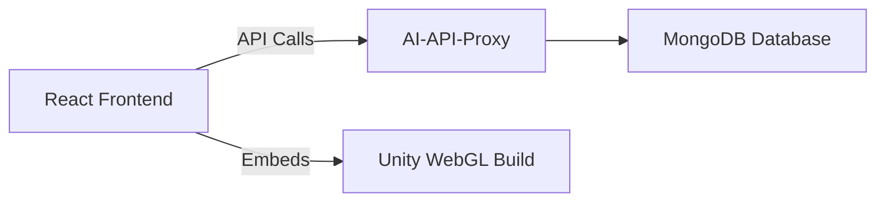

# AI Pharmacy Patient - React Frontend 🏥💊


React frontend application for the AI Pharmacy Patient educational role-play system, featuring Unity WebGL integration and AI-powered interactions.

## Features ✨

- **Unity WebGL Integration**: Seamlessly embeds the [AI Pharmacy Patient Unity application](https://github.com/jsproule899/Unity-AI-Pharmacy-Patient)
- **Educational Role-Play**: Interface designed for pharmacy training scenarios
- **Responsive Design**: Works across desktop and tablet devices
- **AI Interaction Panel**: Companion interface for the 3D patient avatar
- **Session Management**: Tracks and records training sessions
- **Secure Authentication**: JWT-based user sessions

## System Architecture 🏗️



## Prerequisites 📋
- Node.js (v18+ recommended)
- Unity WebGL Build files from [Unity-AI-Pharmacy-Patient](https://github.com/jsproule899/Unity-AI-Pharmacy-Patient) in /public/unity/Build
- Running instance of [AI-API-Proxy](https://github.com/jsproule899/AI-API-Proxy)

## Installation & Setup 🛠️
1. Clone the repository:
```
git clone https://github.com/jsproule899/React-AI-Pharmacy-Patient.git
cd React-AI-Pharmacy-Patient
```
2. Install dependencies:
```
npm install
```
3. Add Unity WebGL build files:
- Build the Unity project
- Copy these files to /public/unity/Build:
```
Build.data.unityweb
Build.framework.js.unityweb
Build.wasm.unityweb
Build.loader.js
```
4. Create .env file and add the base URL for the Proxy API:
```
VITE_API_BASEURL="http://localhost:3030"
```

## Development 🚀
Start the development server:
```
npm run dev
```

Build for production:
```
npm run build
```

## Project Structure 📂
```bash
public/
├── img/               # public images
├── unity/             # Unity files
│   ├── Build/         # Build files
│   └── ...            
src/
├── assets/            # Static assets
├── components/        # Reusable components
│   ├── api/           # Axios components
│   ├── Auth/          # Authenication components
│   ├── Navigation/    # Nav components navbar/footer
│   ├── ui/            # UI components
│   └── ...            
├── hooks/             # Custom React hooks
├── lib/               # utils
├── pages/             # Web application Pages
│   ├── Home/          # Home page 
│   ├── Login/         # Login page and components
│   ├── Scenario/      # Scenario page and components
│   ├── Transcripts/   # Transcripts page and components
│   └── ...            
├── types/             # TypeScript custom types
├── utils/             # Utility functions
├── App.tsx            # Main application
└── main.tsx           # Entry point
index.html             # HTML web page
```